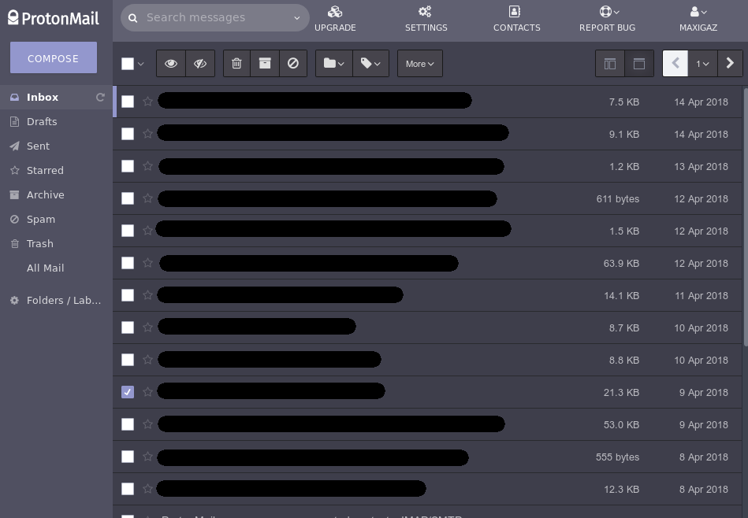
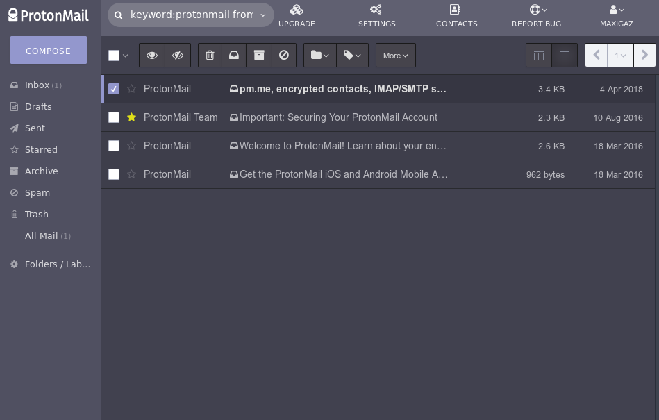
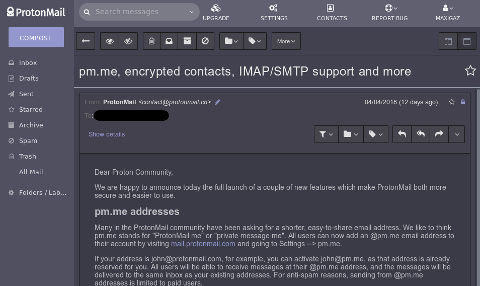

**Note: This repository has been moved. For future updates, please, visit its new location [here](https://gitlab.com/maxigaz/protonmail-dark).**

------------------

# ProtonMail Dark

This style has been written in the [usercss](https://github.com/openstyles/stylus/wiki/Usercss) format, specifically for [Stylus](https://add0n.com/stylus.html), although it might be compatible with other style managers such as [xStyle](https://github.com/FirefoxBar/xStyle).

## Install with Stylus

If you have Stylus installed, click on the banner below and a new window of Stylus should open, asking you to confirm to install the style.

## Install manually or with other style managers

ProtonMail supports custom themes as well. To make use of this feature, copy and paste the [raw CSS code](/../../raw/master/protonmail-dark.user.css) into Settings → Appearance → Custom theme.

In the case of other style managers, you may need to copy and paste manually in the settings of such addons, too.

## Screenshots

